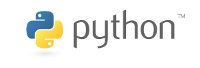
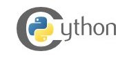
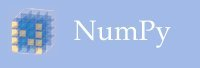

Mission Statement
=================

The yt project aims to produce an integrated science environment for
collaboratively asking and answering astrophysical questions. To do so,
it will encompass the creation of initial conditions, the execution of
simulations, and the detailed exploration and visualization of the
resultant data. It will also provide a standard framework based on
physical quantities interoperability between codes.

Development of yt is driven by a commitment to Open Science principles
as manifested in participatory development, reproducibility, documented
and approachable code, a friendly and helpful community of users and
developers, and Free and Libre Open Source Software.

What has yt been used for?
==========================

Analysis and visualization using yt has been applied to many different
problems within Astrophysics. For a few places yt has been applied, see
the [list of
citations](http://adsabs.harvard.edu/cgi-bin/nph-ref_query?bibcode=2011ApJS..192....9T&refs=CITATIONS&db_key=AST)
to the [yt method
paper](http://adsabs.harvard.edu/abs/2011ApJS..192....9T).

A few of the more fun things yt has been used for include the cover of
the [July 25,
2013](http://www.nature.com/nature/journal/v499/n7459/index.html) issue
of Nature (and the accompanying [ALMA press
release](http://www.almaobservatory.org/en/press-room/press-releases/621-starburst-to-star-bust-alma-sheds-light-on-mystery-of-missing-massive-galaxies)),
a [visualization](http://www.youtube.com/watch?v=tTilF_hbrHE) in the
Adler Planetarium gallery \"A Walk Through Space and Time\" (a version
of which won the XSEDE13 \"Best Visualization\"), and as a visualization
component in the [Seismic Sound Lab](http://www.seismicsoundlab.org/) at
Lamont-Doherty Earth Observatory.

A few talks about yt can be found online, including at [SciPy
2014](http://pyvideo.org/video/2779/yt-volumetric-data-analysis) by
Nathan Goldbaum about yt-3.0 and at [SciPy
2013](http://conference.scipy.org/scipy2013) by Sam Skillman describing
how [volume
rendering](http://conference.scipy.org/scipy2013/presentation_detail.php?id=147)
was developed by and for our community. At [SciPy
2012](http://conference.scipy.org/scipy2012/), Matthew Turk gave an
[overview of
yt](http://pyvideo.org/video/1202/yt-an-integrated-science-environment-for-astroph)
and its goals. And, the entire workshop from January 2012 hosted at the
FLASH center is [available for
viewing](http://yt-project.org/workshop2012/).

A Scientific Ecosystem
======================

yt is built in an ecosystem of packages from the scientific software
community. These includes libraries that have been created, developed
and maintained by hundreds of individuals from different backgrounds.

::: {.row .yt-package}
::: {.col-md-offset-2 .col-md-2}
[{.img-rounded
width="200px"}](http://python.org/)
:::

::: {.col-md-offset-1 .col-md-6}
yt is written in Python, which provides rapid development, scripting
capabilities, and a huge number of packages.
:::
:::

::: {.row .yt-package}
::: {.col-md-offset-2 .col-md-2}
[{.img-rounded
width="200px"}](http://cython.org/)
:::

::: {.col-md-offset-1 .col-md-6}
Where speed is a concern, or C-interoperability is necessary, we utilize
Cython as a mechanism for creating extensions.
:::
:::

::: {.row .yt-package}
::: {.col-md-offset-2 .col-md-2}
[{.img-rounded
width="200px"}](http://numpy.org/)
:::

::: {.col-md-offset-1 .col-md-6}
NumPy is an essential mechanism for fast array computations in Python.
:::
:::

::: {.row .yt-package}
::: {.col-md-offset-2 .col-md-2}
[{.img-rounded
width="200px"}](http://ipython.org/)
:::

::: {.col-md-offset-1 .col-md-6}
IPython is a rich environment for interactive computation.
:::
:::

::: {.row .yt-package}
::: {.col-md-offset-2 .col-md-2}
[{.img-rounded
width="200px"}](http://matplotlib.sf.net/)
:::

::: {.col-md-offset-1 .col-md-6}
Matplotlib is a 2D plotting library for Python for publication-quality
plots and data visualizations.
:::
:::

::: {.container .row .yt-package}
::: {.col-md-offset-3 .col-md-6}
yt also utilizes and benefits from the packages
[h5py](http://www.h5py.org/) as an interface to HDF5,
[mpi4py](https://bitbucket.org/mpi4py/mpi4py/) for MPI parallelism,
[nose](http://nose.readthedocs.org/en/latest/) for testing, and
[SymPy](http://sympy.org/) for symbolic manipulation.

We also thank [GitHub](http://github.com/) for project hosting, and
[ReadTheDocs](http://readthedocs.org/) for automated documentation
building.

The scientific Python ecosystem has greatly benefited from support from
the [NumFOCUS](http://numfocus.org/) foundation.
:::
:::

yt Community Code of Conduct
============================

The community of participants in open source Scientific projects is made
up of members from around the globe with a diverse set of skills,
personalities, and experiences. It is through these differences that our
community experiences success and continued growth. We expect everyone
in our community to follow these guidelines when interacting with others
both inside and outside of our community. Our goal is to keep ours a
positive, inclusive, successful, and growing community.

As members of the community,

-   We pledge to treat all people with respect and provide a harassment-
    and bullying-free environment, regardless of sex, sexual orientation
    and/or gender identity, disability, physical appearance, body size,
    race, nationality, ethnicity, and religion. In particular, sexual
    language and imagery, sexist, racist, or otherwise exclusionary
    jokes are not appropriate.
-   We pledge to respect the work of others by recognizing
    acknowledgment/citation requests of original authors. As authors, we
    pledge to be explicit about how we want our own work to be cited or
    acknowledged.
-   We pledge to welcome those interested in joining the community, and
    realize that including people with a variety of opinions and
    backgrounds will only serve to enrich our community. In particular,
    discussions relating to pros/cons of various technologies,
    programming languages, and so on are welcome, but these should be
    done with respect, taking proactive measure to ensure that all
    participants are heard and feel confident that they can freely
    express their opinions.
-   We pledge to welcome questions and answer them respectfully, paying
    particular attention to those new to the community. We pledge to
    provide respectful criticisms and feedback in forums, especially in
    discussion threads resulting from code contributions.
-   We pledge to be conscientious of the perceptions of the wider
    community and to respond to criticism respectfully. We will strive
    to model behaviors that encourage productive debate and
    disagreement, both within our community and where we are criticized.
    We will treat those outside our community with the same respect as
    people within our community.
-   We pledge to help the entire community follow the code of conduct,
    and to not remain silent when we see violations of the code of
    conduct. We will take action when members of our community violate
    this code such as contacting confidential\@yt-project.org (all
    emails sent to this address will be treated with the strictest
    confidence) or talking privately with the person.

This code of conduct applies to all community situations online and
offline, including mailing lists, forums, social media, conferences,
meetings, associated social events, and one-to-one interactions.

The yt Community Code of Conduct was adapted from the [Astropy Community
Code of Conduct](http://www.astropy.org/about.html#codeofconduct), which
was partially inspired by the PSF code of conduct.
