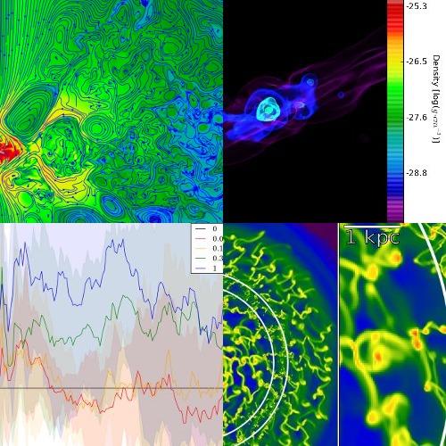
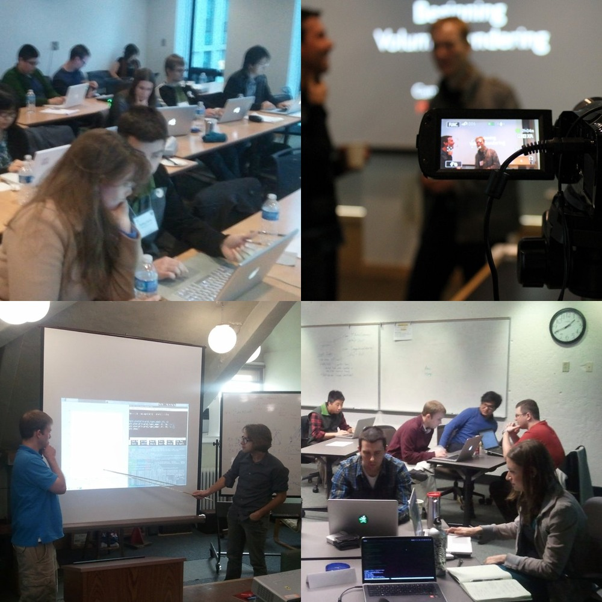
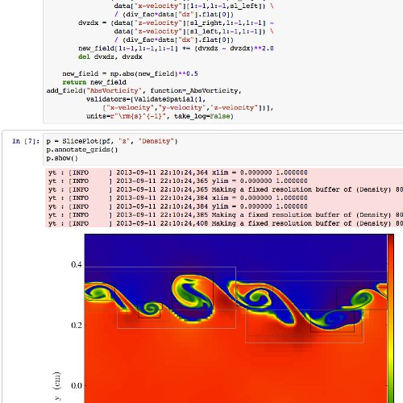

yt is an open-source, permissively-licensed python package for analyzing
and visualizing volumetric data.

yt supports structured, variable-resolution meshes, unstructured meshes,
and discrete or sampled data such as particles. Focused on driving
physically-meaningful inquiry, yt has been applied in domains such as
astrophysics, seismology, nuclear engineering, molecular dynamics, and
oceanography. Composed of a friendly community of users and developers,
we want to make it easy to use and develop --- we\'d love it if you got
involved!

------------------------------------------------------------------------

::: {#learn .row .featurette}
::: {.col-md-7}
Learn: [ getting started.]{.text-muted} {#learn-getting-started. .featurette-heading}
---------------------------------------

To get started using yt to explore data, we provide resources including
[documentation](https://yt-project.org/doc/), [workshop
material](https://yt-project.org/workshop2012/), and even a
fully-executable [quick start
guide](https://yt-project.org/doc/quickstart/index.html) demonstrating
many of yt\'s capabilities.

But if you just want to dive in and start using yt, we have a long list
of [recipes](https://yt-project.org/doc/cookbook/index.html)
demonstrating how to do various tasks in yt. We even have [sample
datasets](https://yt-project.org/data) from all of our supported codes
on which you can test these recipes. While yt should just **work** with
your data, here are some
[instructions](https://yt-project.org/doc/examining/index.html) on
loading in datasets from our supported codes and formats.

[Get Started](https://yt-project.org/doc/quickstart/index.html){.btn
.btn-llg .btn-primary .yt-btn}
:::

::: {.col-md-5}
{.featurette-image .img-rounded
.img-responsive}
:::
:::

------------------------------------------------------------------------

::: {#community .row .featurette}
::: {.col-md-5}
{.featurette-image
.img-rounded .img-responsive}
:::

::: {.col-md-7}
Community: [yt\'s best feature.]{.text-muted} {#community-yts-best-feature. .featurette-heading}
---------------------------------------------

yt is a friendly community. We like hearing about fun things you have
done with the code, and we\'re happy to help you out if you have a
question or some trouble. You can join us in IRC, on the mailing lists,
and if you\'d like, you can check out how to [develop,
too](#development).

If you\'ve got some code to share, or scripts that you\'d like to share,
start up a repo on [GitHub](https://github.com/) or Bitbucket or share
them on our [pastebin](https://paste.yt-project.org/). If you have any
trouble, drop by the [mailing
list](https://mail.python.org/mm3/mailman3/lists/yt-users.python.org/)
and we\'ll be happy to help out.

[Join the Community](community.html){.pull-right .btn .btn-llg
.btn-primary}
:::
:::

------------------------------------------------------------------------

[]{#development}

::: {#development .row .featurette .row_anchor}
::: {.col-md-7}
Participatory [ development.]{.text-muted} {#participatory-development. .featurette-heading}
------------------------------------------

If you\'re interested in getting started with helping out, the easiest
way is to [Fork us on GitHub](https://github.com/yt-project/yt), check
out the [developer
guide](https://yt-project.org/doc/developing/index.html), and stop by
the [development mailing
list](https://lists.spacepope.org/listinfo.cgi/yt-dev-spacepope.org). yt
is released under the modified BSD License.

There are lots of [fun projects to work
on](https://yt-project.org/doc/developing/developing.html#technical-contributions),
along with some [open issues](https://github.com/yt-project/yt/issues),
and we\'d particularly like if you\'d help out by [adding support for a
a new data
format](https://yt-project.org/doc/developing/creating_frontend.html) or
if you\'d like to help out by shoring up support for a [semi-supported
output format](https://yt-project.org/doc/reference/code_support.html).

[Develop!](development.html){.pull-left .btn .btn-llg .btn-primary}
:::

::: {.col-md-5}
{.featurette-image .img-rounded
.img-responsive}
:::
:::

------------------------------------------------------------------------

[]{#getyt}

::: {.row .row_anchor}
::: {.col-md-5}
Get yt: all-in-one script.
==========================

yt is built on a stack of completely [free and libre open source
software](https://www.fsf.org/working-together/), with **no**
proprietary dependencies. It provides its own install script, to assist
with constructing an isolated environment that can be upgraded and
operated independently of the host operating system.

If you use yt in a publication, we request that you please consider
citing [our method
paper](https://adsabs.harvard.edu/abs/2011ApJS..192....9T)
([BibTeX](https://adsabs.harvard.edu/cgi-bin/nph-bib_query?bibcode=2011ApJS..192....9T&data_type=BIBTEX&db_key=AST&nocookieset=1)).

Usually getting yt is as simple as running the installation script.
Simply download the install script and run it. You can do this using
[wget]{.yt_code} or [curl]{.yt_code}, or even just right click and
choose **Save As**. Carefully read the instructions the script prints to
your terminal since there might be special instructions for your
operating system.

[Download](https://raw.githubusercontent.com/yt-project/yt/master/doc/install_script.sh){.btn
.btn-llg .btn-warning}\

Once you\'ve downloaded it, just run:

::: {.yt_code}
\$ bash install\_script.sh\
\$ export PATH=/path/to/YT\_DEST/bin:\$PATH
:::

where YT\_DEST will be the folder created by the install script
containing a yt installation (usually [yt-conda]{.yt_code}).
:::

::: {.col-md-offset-1 .col-md-6}
Get yt: using conda.
====================

If you use the [anaconda python
distribution](https://store.continuum.io/cshop/anaconda/) or use
[[conda](https://pypi.python.org/pypi/conda)]{.yt_code} to manage python
packages, you can install the latest stable version of yt with the
following command:

::: {.yt_code}
\$ conda install -c conda-forge yt
:::

Or a nightly development build:

::: {.yt_code}
\$ conda install -c http://use.yt/with\_conda yt
:::

Get yt: from source.
====================

If you are comfortable installing Python packages and have a build
environment set up, you can install yt via [pip]{.yt_code}:

::: {.yt_code}
\$ pip install yt
:::

If you would like to install the development version of yt, just clone
the repository and execute the setup.py script:

::: {.yt_code}
\$ git clone https://github.com/yt-project/yt\
\$ cd yt\
\$ python setup.py develop
:::
:::
:::
:::

::: {.container}
::: {.row}
::: {.col-lg-2}
[{width="150 px"}](https://www.nsf.gov/)
:::

::: {.col-lg-2}
[{width="150 px"}](https://moore.org/)
:::

::: {.col-lg-2}
[{width="150 px"}](https://www.numfocus.org)
:::

::: {.col-lg-6}
yt has benefited from work supported by the National Science Foundation
under Grant No.
[1535651](https://www.nsf.gov/awardsearch/showAward?AWD_ID=1535651)
([proposal](https://figshare.com/articles/SI2_SSE_yt_Reusable_Components_for_Simulating_Analyzing_and_Visualizing_Astrophysical_Systems/909413)).
It has also benefited from work supported by the Gordon and Betty Moore
Foundation\'s Data-Driven Discovery Initiative through Grant GBMF4561 to
Matthew Turk.

yt is a fiscally-sponsored project of [NumFOCUS](https://numfocus.org/).
:::
:::
:::
